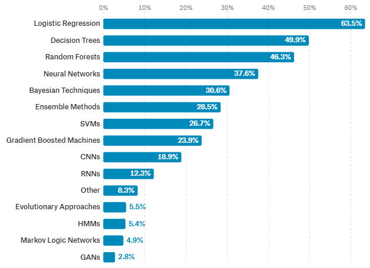
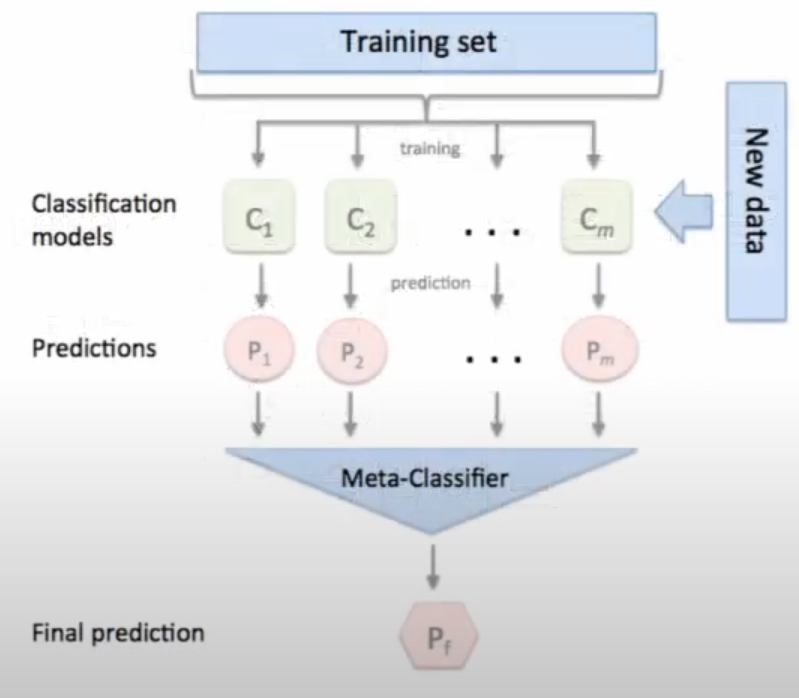

## What is decision tree?
Choose best feature to split

- 데이터 과학자들이 많이 사용하는 머신러닝 기법

## Ensemble

- 하나의 모델이 아니라 여러 개 모델의 어울림 예측
- Regression 문제에서는 평균값을 예측함
- Stacking (meta-ensemble) 등으로 발전
- 학습은 오래 걸리나 성능이 매우 좋음
- Kaggle의 대세 기법 (structed dataset)
- Meta-classifier

### Meta-classifier
여러 clssifier model들이 예측한 결과를 종합해서 최종 예측을 해주는 것

### Bootstrap

- 학습 데이터에서 임의의 복원 추출
  - subset 학습 데이터 n개를 추출하는 것

### Bagging

- 

## decision tree vs. random forest

- decision tree는 큰 나무 하나
- random forest는 작은 나무 여러개로 된 숲 (나무는 각자 조금 다름)

### Random Forest keyword : boosting - biased data clooection
- decision tree에서는 데이터 전부 사용 vs. random forest는 데이터 부분적으로 
- boosting = 중복된 데이터 포함 → biased data clooection

### Random Forest keyword : random selection of feature set
- decision tree = 가장 좋은 질문을 가장 먼저 수행
- random forest = 랜덤하게 선택하기 때문에 가장 먼저 수행한 것이 가장 좋은 질문이 아닐 수 있다

### Random Forest keyword : aggregating of result (voting)
- 그래서 bagging 이라고도 한다.

# Recommended Videos
- [Random Forest - Fun and Easy Machine Learning](https://www.youtube.com/watch?v=D_2LkhMJcfY)
  - 나름 깔끔하게 부담없이 볼 수 있도록 이미지 위주의 설명

# Reference

- [Minsuk Heo - 랜덤포레스트](https://www.youtube.com/watch?v=nZB37IBCiSA)
- [데이터홍교수 도움ai 인생코드 - 랜덤포레스트](https://www.youtube.com/watch?v=BP40f817tL4)
- [IN WHAT STATE THEY ARE TO BE FOUND?](http://www.dexlabanalytics.com/blog/data-science-and-machine-learning-in-what-state-they-are-to-be-found)
