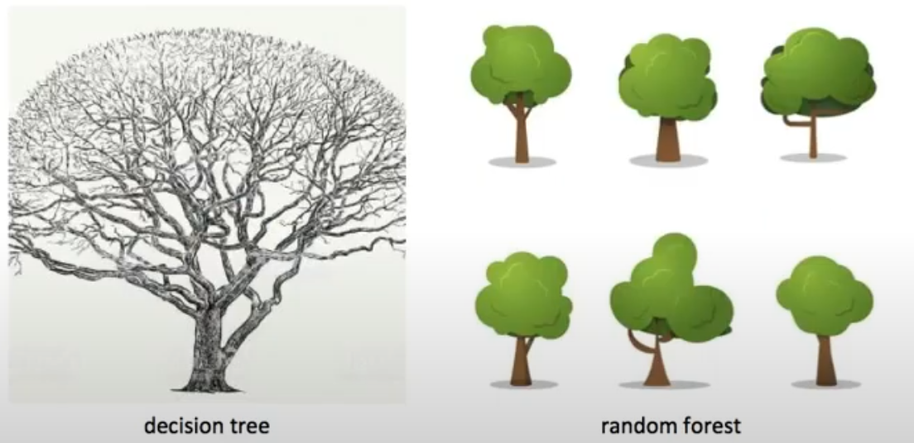
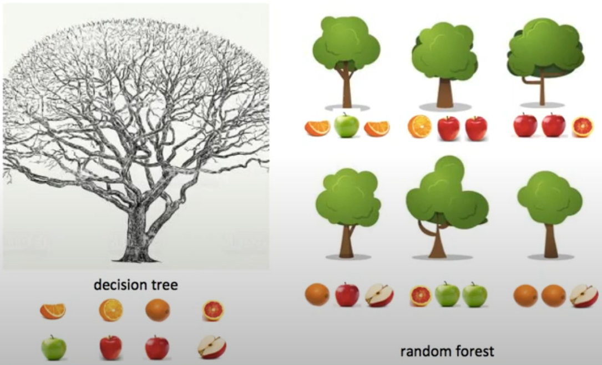
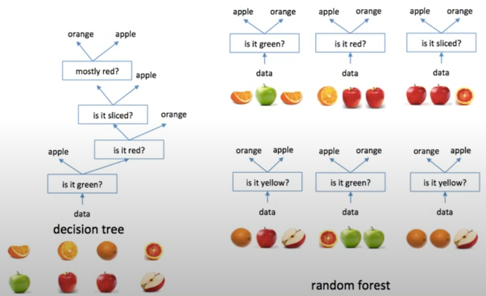
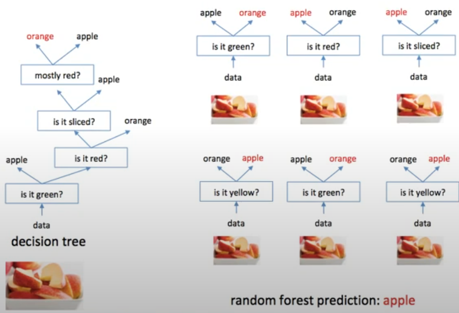

## What is decision tree?
Choose best feature to split

## decision tree vs. random forest

- decision tree는 큰 나무 하나
- random forest는 작은 나무 여러개로 된 숲 (나무는 각자 조금 다름)

### Random Forest keyword : boosting - biased data clooection
- decision tree에서는 데이터 전부 사용 vs. random forest는 데이터 부분적으로 
- boosting = 중복된 데이터 포함 → biased data clooection

### Random Forest keyword : random selection of feature set
- decision tree = 가장 좋은 질문을 가장 먼저 수행
- random forest = 랜덤하게 선택하기 때문에 가장 먼저 수행한 것이 가장 좋은 질문이 아닐 수 있다

### Random Forest keyword : aggregating of result (voting)
- 그래서 bagging 이라고도 한다.

# Reference

- [Minsuk Heo - 랜덤포레스트](https://www.youtube.com/watch?v=nZB37IBCiSA)
