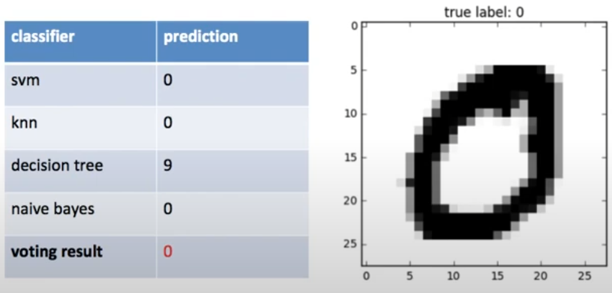
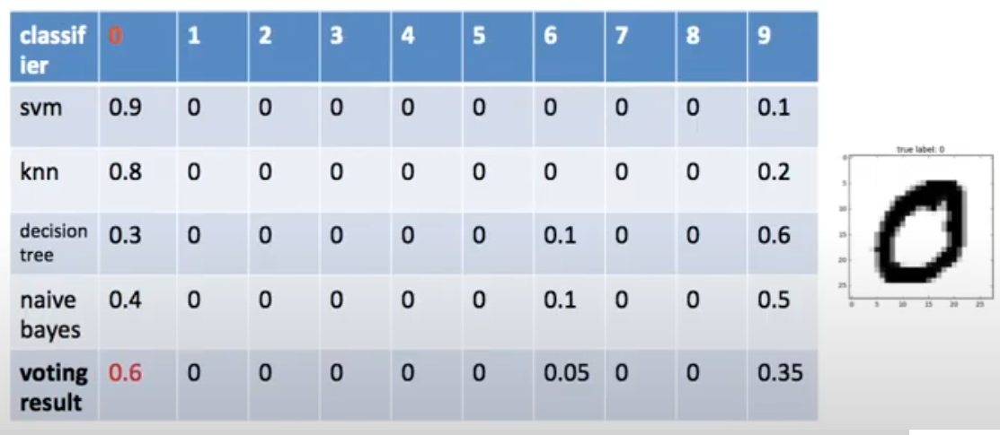

# What is Ensemble?
여러 모델들을 함께 결과를 도출하게 함으로써 최적의 결과를 얻는 방법

## What is Voting

### Hard Voting
모두 1표씩 가지고 투표

### Soft Voting
모두 1표씩 가지고 투표

- confidence value를 가지고, 각 결과 후보 중 높은 합을 보이는 것을 결과로 리턴

# Reference

- [Minsuk Heo - 앙상블-하드보팅,소프트보팅](https://www.youtube.com/watch?v=y4Wh0E1d4oE)
