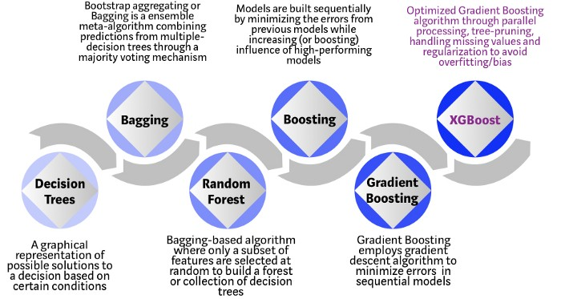
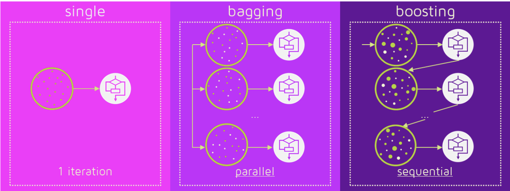

## history of algorithm




## 부스팅(Boosting)
- sample 뽑을 때 잘못 분류된(예측이 틀린) data 50%를 재학습
- 순차적이기 때문에, 병렬 진행을 할 수 없다




### AdaBoost
- 대표적인 Boost 알고리즘
- 전체 훈련 샘플 사용하고, 잘못 분류된 data에 가중치 적용


## GBM (Gradient Boosting Algorithm)
Boosting 계열의 알고리즘이기 때문에 순차적으로 약한 학습기 (weak learner)를 만들어 가며 이전 학습기의 잔차 (resuidual)를 보완하는 방식

- 잔차 (Residual) = 결과의 오류
- 약한 학습기를 잔차 자체에 적합하고, 이전의 예측값에 예측한 잔차를 더해 주어 예측값을 새로이 업데이트하는 방식


### Gradient Descent (경사하강법)


- 기울기 = 0일 때 보통 극값을 갖기 때문에 기울기 > 0이면 x가 극소값보다 오른쪽에 있다는 뜻이므로 학습률 * 기울기만큼 빼주어 왼쪽으로 이동
- 기울기 <0이면 극소값보다 왼쪽에 있다는 뜻이므로 학습률 * 기울기만큼 더해주어 오른쪽으로 이동시켜주는 원리
- 이를 무한 반복하는 것은 아니고 t번째 값인 xt와 t−1번째 값인 xt−1 번째 값이 거의 같으면 그 값이 수렴했음을 의미하기 때문에 반복을 멈춥니다.


### Boosting과 Gradient Descent의 관계

- 손실 함수 (Loss Function, 예측값 F(x)과 실제 값 y의 차이) =  MSE (Mean Squared Error)를 2로 나눈 것으로 정의
- 잔차 (residual) = 이 손실 함수의 1차 미분값 (gradient)의 음수
- 이 손실 함수의 극소값을 찾는 데 gradient descent를 이용한 최적화 문제로 치환 가능


### Sample Code

```python
import pandas as pd

df = pd.DataFrame({
    '키'         : [1.6,1.6,1.5,1.8, 1.3, 1.6],
    '좋아하는 색':['파랑','초록','파랑','초록','분홍','파랑'],
    '성'         :['M','F','F','M','M','F'],
    '몸무게'     :[88,76,56,80,30,52]})

df = pd.get_dummies(df)

print(df)
```

- string으로 되어있는 값들을 숫자형으로 변경하면서 one-hot-encode까지 진행

```python
import numpy as np

input = df.loc[:,df.columns!='몸무게']
target = df['몸무게']

F0 = np.mean(target)

print(F0)
```

- target 값의 평균으로 모형 초기화

```python
r1 = target - F0

print(r1)
```

- 첫 번째 잔차 r1=y−F0(x) 값을 구하자

```python
from sklearn.tree import DecisionTreeRegressor

tree1 = DecisionTreeRegressor(max_depth=2, random_state=42)

r1_fit = tree1.fit(input, r1)

gamma1  = r1_fit.predict(input)

print ('잔차 예측값:{}'.format(np.unique(gamma1)))
```

- 이 잔차에 깊이가 2인 DecisionTreeRegressor를 적합해 잔차 예측값인 γ를 구하자

```python
from sklearn.tree import export_graphviz

export_graphviz(
    tree1,
    out_file="tree.dot",
    feature_names=['height','pink','green','blue','female','male'],
    class_names='몸무게',
    rounded=True,
    filled=True
)

from subprocess import call
call(['dot', '-Tpng', 'tree.dot', '-o', 'decistion-tree.png', '-Gdpi=600'])

from IPython.display import Image
Image(filename = 'decistion-tree.png')
```

- 지금 진행한 내역을 시각화 해보자

```python
eta = 0.1
F1 = F0 + eta * gamma1

print ('첫번째 예측값:{}'.format(F1))
```

- 마지막으로 예측값을 업데이트하자
  - eta : 학습률
  - gamma1 : 첫번째 잔차를 예측한 값
  - F1 : 새로 예측된 y 값

- 이 과정을 내가 정한 반복수 T만큼 반복하면 다음과 같이 GBM을 구현할 수 있다.

```python
F_new = np.mean(target)

tree = DecisionTreeRegressor(max_depth=2, random_state=42)

eta = 0.1

for t in range(100):
    print(str(t+1)+'번째 업데이트')

    F_old = F_new
    r     = target - F_old
    r_fit = tree.fit(input,r)
    gamma = r_fit.predict(input)

    print('잔차 예측값:{}'.format(np.round(np.unique(gamma),2)))

    F_new = F_old + eta * gamma

    print('예측값:{}'.format(np.round(F_new,2)))
```

- 반복될 수록 결과가 좋아지는 것을 볼 수 있다.


# Reference
- [XGBoost Algorithm: Long May She Reign!](https://towardsdatascience.com/https-medium-com-vishalmorde-xgboost-algorithm-long-she-may-rein-edd9f99be63d)
- [이상철 교수 - 앙상블학습(랜덤 포레스트와 부스팅)](https://www.youtube.com/watch?v=nsx3kHGVLlo&t=24s)
- [Haesun Park - 앙상블 학습과 랜덤 포레스트 (2)](https://www.youtube.com/watch?v=dyzMjL06dtc)
- [배깅 (Bagging)과 부스팅 (Boosting)의 원리](https://assaeunji.github.io/ml/2020-08-06-tree/)
- [GBM (Gradient Boosting Machines)에 대한 자세한 설명 (1)](https://assaeunji.github.io/ml/2020-09-05-gbm/)
