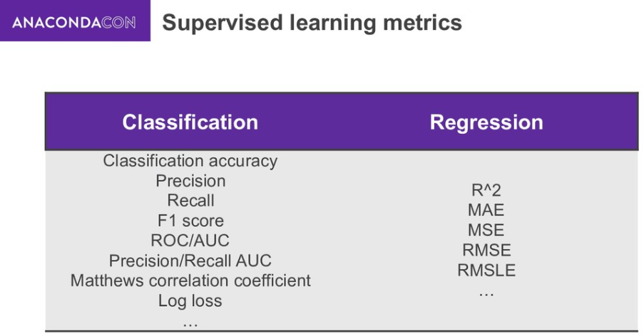
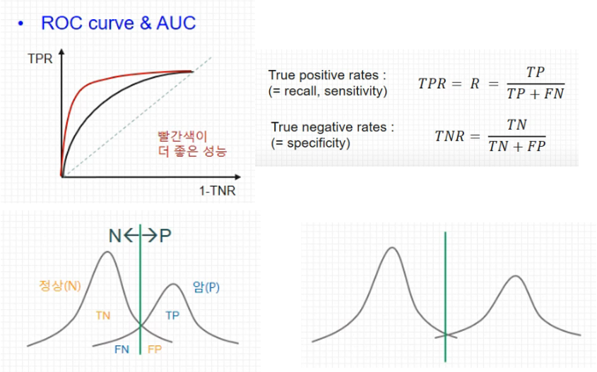

## Metrics of Supervised Learning

## Metrics of Classification

### Accuracy (정확도)
- 전체 중에서 정답을 맞춘 비율
- True, False 상관 없음
- bias 단점 존재 → 정확도 역설 (Accuracy Paradox) = Negative 비율이 높다면?
  - Precision / Recall 은 영향도가 낮음

### Precision (정밀도)
- = PPV (Positive Predictive Value)
- True라고 분류한 것 중에서 실제 True인 비율
- 1에 가까울 수록 좋음
- 100명중 4명이 양성인 데이터가 있을 때, 2명만 양성이라고 판정했다면 2명을 놓쳤지만 정밀도는 100%가 된다.

### Recall (재현율)
- = sensitivity, hit rate
- 실제 True인 것 중에서 모델이 True라고 예측한 비율
- 100명중 4명이 양성인 데이터가 있을 때, 2명만 양성이라고 판정했다면 Recall은 50%가 된다.
- Precvision과 Recall은 반비례하는 경향 → 보완하기 위해 `F1 Score` 등장

### F1 Score
- Precision과 Recall의 조화 평균 → 높아야 성능이 좋다
- 평균(산술평균)을 쓰면 recall, precision 둘 중 하나가 0에 가깝게 낮을 때 지표에 그것이 잘 반영되지 않음 → 조화 평균

### Fall-out
- = FPR (False Positive Rate)
- 실제 False 중에서 모델이 True라고 예측한 비율

### ROC AUC (Receiver Operating Characteristic Curve & Area Under the Curve)
- Binary Classifier System(이진 분류 시스템)에 대한 성능 평가 기법
- 면적(AUC)의 크기로 더 큰 것이 좋다
- Negative와 Positive가 최대한 벌어져 있는 것이 더욱 분리하기 쉬움 = AUC 크기가 큰 것 (위 그림에서 빨간선)

## Metrics of Regression

### MAE (Mean Absolute Error)
- 모델의 예측값과 실제값의 차이를 모두 더한다
- 절대값을 취하기에 직관적 → 하지만, underporformance/overperformance 구분 못함
  - underporformance : 모델이 실제보다 낮은 값으로 예측
  - overperformance : 모델이 실제보다 높은 값으로 예측
- MSE 대비 특이치에 강하다 = robust

### MAPE (Mean Absolute Percentage Error)
- MAE를 퍼센트로 변환
- 모델에 대한 bias 존재
- 0 근처의 값에서는 사용하기 어려움

### MSE (Mean Squared Error)
- 모델의 예측값과 실제값 차이의 면적의 합
- 특이치가 존재하면 수치가 많이 늘어난다 → 특이치에 민감

### RMSE (Root Mean Squared Error)
- MSE에 Root 씌운 것
- 오류 지표를 실제 값과 유사한 단위로 다시 변환 → 해석을 쉽게 한다

### R2 Score (Coefficient of Determination, 결정계수)
- 상대적으로 얼마나 성능이 나오는지를 측정한 지표
- 결정계수의 경우 상대적인 성능이기 때문에 이를 직관적으로 알 수 있음
  - RMSE나 MAE는 데이터의 scale에 따라서 값이 천차만별 → 절대 값만 보고 바로 성능을 판단하기가 어려움

# Reference
- [Machine Learning Model Evaluation Metrics #AnacondaCON](https://speakerdeck.com/mkhalusova/machine-learning-model-evaluation-metrics-number-anacondacon?slide=3)
- [모델 성능 평가 지표 (회귀 모델, 분류 모델)](https://rk1993.tistory.com/entry/모델-성능-평가-지표-회귀-모델-분류-모델)
