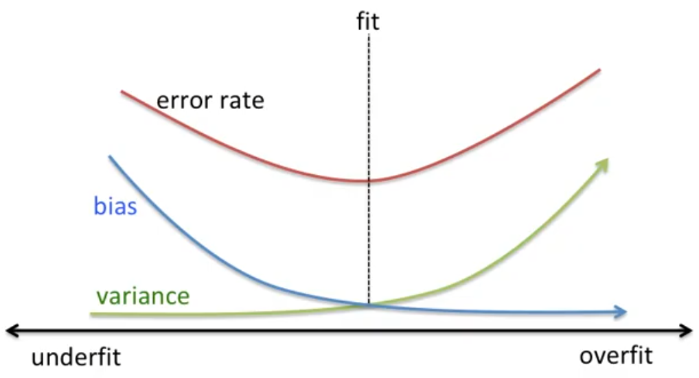
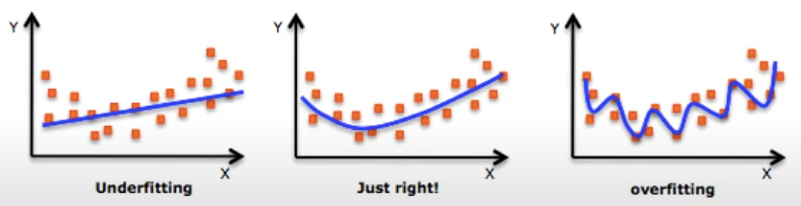
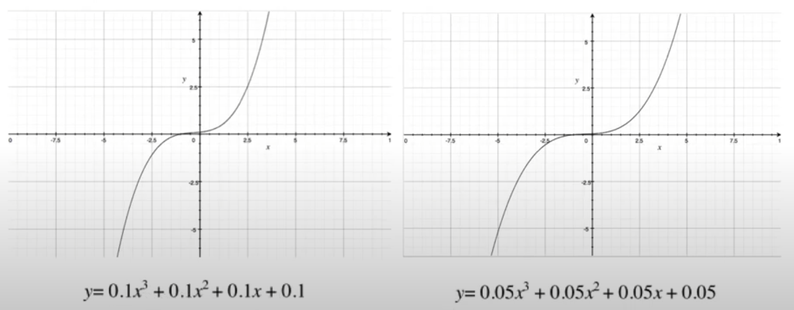

## bias vs. variance

### bias
실제값에서 얼마나 멀리 있는가

### variance
예측된 값들이 서로간에 얼마나 멀리 떨어져 있는가

### trade-off
error rate & bias & variance 모두 낮은 부분을 찾아야 한다.

## Underfitting vs. Overfitting

### Underfitting
- too bias

### Overfitting
- high variabces, less bias

## How to overcome underfitting?

- Find more features
- Try high variance machine learning models (Decision Tree, k-NN, SVM)

## How to find if overfitting ?

- when test error is much higher than training error

## How to overcome overfitting?

### Cross Validation (K-Folds Cross Validation)
1. During training, test against validation data
1. if validation accuracy is lower, do regularization!
1. repeat regulaization until no overfitting

### Regularization

- Let model simpler by giving more bias and less variance

- 앞의 계숫값을 줄임으로써 그래프가 가파른 것이 조금 더 완만해짐을 볼 수 있다 = variance 낮아졌음

### Add more data as much as possible

# Reference

- [Minsuk Heo - 머신러닝 오버피팅 (overfitting)](https://www.youtube.com/watch?v=f4sP7OE68-A)
- [Minsuk Heo - 오버피팅, 언더피팅 제대로 이해하고 극복하기](https://www.youtube.com/watch?v=5wQ64XqQQhQ)
- [bias and variance](http://scott.fortmann-roe.com/docs/BiasVariance.html)
