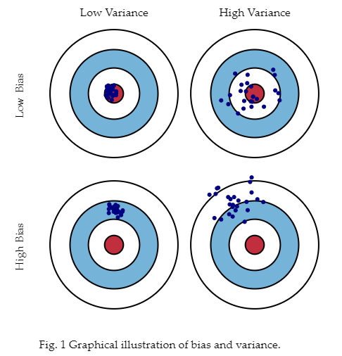

## bias vs. variance

### bias
실제값에서 얼마나 멀리 있는가

### variance
예측된 값들이 서로간에 얼마나 멀리 떨어져 있는가

## Underfitting vs. Overfitting

### Underfitting
- too bias

### Overfitting
- high variabces, less bias

## How to overcome overfitting?

- Regularization
- Cross Validation
- Add more data as much as possible

# Reference

- [Minsuk Heo - 머신러닝 오버피팅 (overfitting)](https://www.youtube.com/watch?v=f4sP7OE68-A)
- [Minsuk Heo - 오버피팅, 언더피팅 제대로 이해하고 극복하기](https://www.youtube.com/watch?v=5wQ64XqQQhQ)
- [bias and variance](http://scott.fortmann-roe.com/docs/BiasVariance.html)
