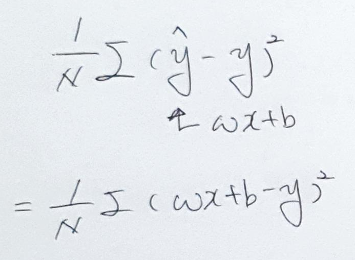
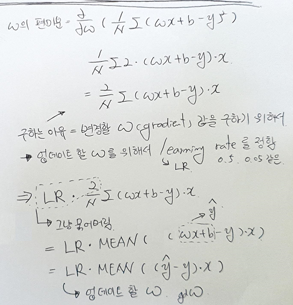
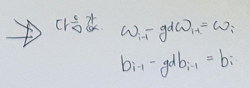

# Chapter05. 회귀 (Regression)

- 영국의 통계학자 갈톤(Galton) 연구에서 유래
  - 부모와 자식 간의 키의 상관 관계 연구
  - 사람의 키는 평균 키로 회귀하려는 경향을 가진다는 자연 법칙
- 회귀 분석 : 데이터 값이 평균과 같은 일정한 값으로 돌아가려는 경향을 이용한 통계학 기법


- 머신러닝 회귀 예측 = 학습을 통해 `최적의 회귀 계수`를 찾아내는 것


## 회귀 유형 구분

### 독립 변수 개수에 따라
- 단일 회귀 : 1개의 독립 변수
- 다중 회귀 : 복수 개의 독립 변수


### 회귀 계수의 결합
- 선형 회귀 : 직선형 회귀선을 최적화 하는 방식. 가장 많이 사용되는 회귀 유형
- 비선형 회귀


## 선형 회귀 모델 종류

### `일반 선형 회귀`
예측값과 실제값의 RSS(Residual Sum of Squares)를 최소화할 수 있도록 회귀 계수를 최적화하며, 규제(Regularization)를 적용하지 않은 모델


### `릿지 (Ridge)`
선형 회귀에 L2 규제를 추가한 회귀 모델

- L2 규제 = 상대적으로 큰 회귀 계수 값의 예측 영향도를 감소시키기 위해서 회귀 계수값을 더 작게 만드는 규제 모델


### `라쏘 (Lasso)`
선형 회귀에 L1 규제를 적용한 회귀 모델

- L1 규제 = 예측 영향력이 작은 피처의 회귀 계수를 0으로 만들어 회귀 예측 시 피처가 선택되지 않도록 만드는 규제 모델 (피처 선택 기능)


### `엘라스틱넷 (ElasticNet)`
L2, L1 규제를 함께 결합한 모델

- 주로 피처가 많은 데이터 세트에서 적용되며, L1 규제로 피처의 개수를 줄임과 동시에 L2 규제로 계수 값의 크기를 조정


### `로지스틱 회귀 (Logistic Regression)`
회귀라는 이름이 붙어있지만, 실제로는 분류에 사용되는 선형 모델 (매우 강력한 분류 알고리즘)

- 일반적으로 이진 분류뿐만 아니라 희소 영역의 분류에서 뛰어난 예측 성능 (like 텍스트 분류)


## 단순 선형 회귀
독립 변수도 하나, 종속 변수도 하나인 선형 회귀


- 오류값 합이 최소가 될 수 있는 최적의 회귀 계수를 찾는 과정
- 오류값은 +나 -가 될 수 있음 = 절대값 or 제곱
  - 절대값 : Mean Absolute Error, MAE
  - 제곱 : Residual Sum of Square, RSS (아래 그림과 같이 SSE라고도 함)


- RSS = 비용 함수 = 손실 함수 (loss function)
  - RSS : 오차의 평균





## 비용 최소화 = 경사 하강법 (Gradient Descent)
RSS를 가지고 w의 편미분, b의 편미분을 한 결과를 이용


- w 편미분




- b 편미분


- 편미분 결과를 이용하여 다음 값을 계산




## Gradient Descent 실습
- [gradient_descent.ipynb](gradient_descent.ipynb)


## 보스턴 주택 가격 회귀 구현
- [sklearn_boston.ipynb](sklearn_boston.ipynb)


---


## 다항 회귀 (Polynomial Regression)


- 단순 선형 회귀 (Simple Linear Regression)
- 다중 선형 회귀 (Multiple Linear Regression)
- 다항 선형 회귀 (Polynomial Linear Regression)


### Linear Regression


### Polynomial Regression


### PolynomialFeatures
- \[ x<sub>1</sub>, x<sub>2</sub> ] → \[ 1, x<sub>1</sub>, x<sub>2</sub>, x<sub>1</sub><sup>2</sup>, x<sub>1</sub>x<sub>2</sub>, x<sub>2</sub><sup>2</sup> ]

```python
from sklearn.preprocessing import PolynomialFeatures
import numpy as np

# 다항식으로 변환한 단항식 생성, [[0,1],[2,3]]의 2X2 행렬 생성
X = np.arange(4).reshape(2,2)
print('일차 단항식 계수 feature:\n',X )

# degree = 2 인 2차 다항식으로 변환하기 위해 PolynomialFeatures를 이용하여 변환
poly = PolynomialFeatures(degree=2)
poly.fit(X)
poly_ftr = poly.transform(X)
print('변환된 2차 다항식 계수 feature:\n', poly_ftr)
```

- 모델링 알고리즘이 아니라, 변환기이다.

```python
def polynomial_func(X):
    y = 1 + 2 * X + X ** 2 + X ** 3
    return y

X = np.arange(4).reshape(2,2)
print('일차 단항식 계수 feature: \n' ,X)
y = polynomial_func(X)
print('삼차 다항식 결정값: \n', y)

# 3 차 다항식 변환 
poly_ftr = PolynomialFeatures(degree=3).fit_transform(X)
print('3차 다항식 계수 feature: \n',poly_ftr)

# Linear Regression에 3차 다항식 계수 feature와 3차 다항식 결정값으로 학습 후 회귀 계수 확인
model = LinearRegression()
model.fit(poly_ftr,y)
print('Polynomial 회귀 계수\n' , np.round(model.coef_, 2))
print('Polynomial 회귀 Shape :', model.coef_.shape)
```

- `PolynomialFeatures → LinearRegression` 방법으로 다항 회귀 구현

- `Pipeline`을 이용해서 한 번에 구현 가능

```python
from sklearn.preprocessing import PolynomialFeatures
from sklearn.linear_model import LinearRegression
from sklearn.pipeline import Pipeline
import numpy as np

def polynomial_func(X):
    y = 1 + 2 * X + X ** 2 + X ** 3
    return y

# Pipeline 객체로 Streamline 하게 Polynomial Feature변환과 Linear Regression을 연결
model = Pipeline([('poly', PolynomialFeatures(degree=3)), ('linear', LinearRegression())])
X = np.arange(4).reshape(2,2)
y = polynomial_func(X)

model = model.fit(X, y)
print('Polynomial 회귀 계수\n', np.round(model.named_steps['linear'].coef_, 2))
```


### degree = 다항 회귀의 차수
- degree ↑ = 복잡한 피처 간의 관계까지 모델링 가능 = 학습 데이터에만 맞춘 학습 = 테스트 환경에서 정확도 하락 = 과적합


### 편향-분산 트레이드오프 (Bias-Variance Trade off)


- degree=1  → 매우 단순화된 모델 = 지나치게 한 방향성으로 치우침 = 고편향 (High Bias)
- degree=15 → 매우 복잡한 모델 = 지나치게 높은 변동성 = 고분산 (High Variance)

- 편향이 높으면 분산은 낮아짐 = 과소 적합
- 분산이 높으면 편향이 낮아짐 = 과대 적합

- 편향을 낮추고 분산을 높이면서 전체 오류가 가장 낮아지는 지점 = `골디락스`


## 규제 선형 모델 - 릿지 / 라쏘 / 엘라스틱넷
