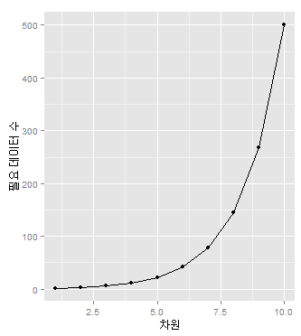
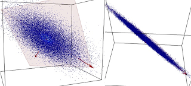
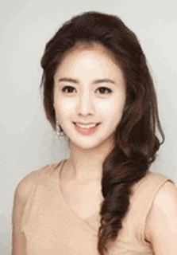
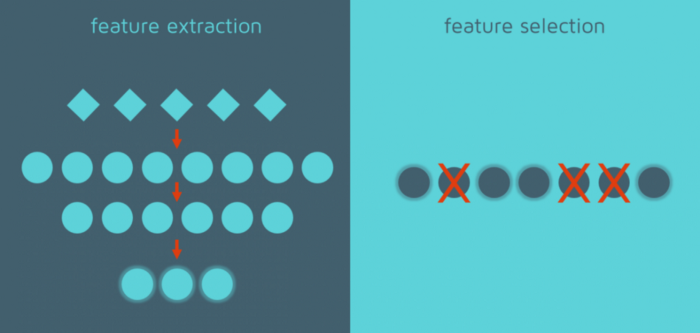

# Chapter.06 차원 축소 (Dimension Reduction)
매우 많은 피처로 구성된 다차원 데이터 세트의 차원을 축소해 새로운 차원의 데이터 세트를 생성하는 것

- 차원 증가 → 데이터 포인트 間 거리가 기하급수적으로 멀어짐 & 희소(Sparse)한 구조
- 수백 개 이상의 피처로 구성된 데이터 세트 → 상대적으로 적은 차원에서 학습된 모델보다 예측 신뢰도 낮음
- 피처 多 → 개별 피처 間 상관 관계가 높을 가능성 大 → 선형 모델에서 이로 인한 `다중 공선성 문제`로 모델 예측 성능 저하

## (추가) 차원의 저주 (Curse of Dimensionality)
- 차원이 높아질수록 필요한 데이터의 수는 기하급수적으로 증가

- 고차원의 데이터들은 의미를 제대로 표현하기 어려움 → 차원 축소 필요
- 차원 축소 = 데이터의 의미를 제대로 표현하는 특징을 추려내는 것

## 차원 축소

- `피처 선택(feature selection, 특성 선택)` : 특정 피처에 종속성이 강한 불필요한 피처 제거 (= 데이터의 특징을 잘 나타내는 주요 피처만 선택)
- `피처 추출(feature extraction, 특성 추출)` : 기존 피처를 저차원의 중요 피처로 압축해서 추출 (= 이렇게 새롭게 추출된 중요 특성은 기존의 피처와는 완전히 다른 값)

## 대표적인 차원 축소 알고리즘

- PCA (Principal Component Analysis) : 가장 대표적인 차원 축소 기법
- LDA (Linear Discriminant Analysis) : 선형 판별 분석법. PCA와 매우 유사
- SVD (Singular Value Decomposition) : 행렬 분해 기법 이용. 정방행렬만 분해할 수 있는 PCA와 달리 행과 열이 다른 행렬에도 적용 가능
- NMF (Non-Negative Matrix Factorization) : Truncated SVD와 같이 낮은 랭크를 통한 행렬 근사 방식의 변형

---

## PCA (Principal Component Analysis, 주성분 분석)
여러 변수 간에 존재하는 상관관계를 이용해 이를 대표하는 주성분(Principal Component)을 추출해 차원을 축소하는 기법

- PCA로 차원을 축소할 때 기존 데이터의 정보 유실이 최소화 되도록...
- 이를 위해서 PCA는 가장 높은 분산을 갖는 데이터의 축을 찾아 이 축으로 차원을 축소 ← 이것이 PCA의 주성분

> 입력 데이터의 변동성이 가장 큰 축을 구하고, 다시 이 축에 직각인 축을 반복적으로 축소하려는 차원 개수만큼 구한 뒤 입력 데이터를 이 축들에 투영해 차원을 축소하는 방식

### (추가) 사례 : http://t-robotics.blogspot.com/2013/07/pca.html

- 약 1000개의 3차원 데이터
  - (x,y,z) 좌표 1000개 = 3000개 숫자 저장
  - But, 거의 한 평면에 존재 → 좌표축만 잘 설정한다면 z값 필요없이 (x, y)값만으로도 표현 가능 → 2000개 숫자로 데이터 감소
- UIUC의 박사과정 학생 Jia-Bin Huang은 미스코리아 대회에 출전한 20명의 얼굴이 얼마나 공통점이 많을까 PCA로 압축 시도
  - 6개의 eigenface(대표적 얼굴)로 대표 가능

### (추가) PCA는 피처 선택일까 피처 추출일까?
- 피처 추출(feature extraction)이다. 피처 선택(feature selection)이 아니다.

## LDA (Linear Discriminant Analysis, 선형 판별 분석법)
PCA와 유사하게 입력 데이터 세트를 저차원 공간에 투영해 차원을 축소하는 기법

- 특징은 Classification에서 사용하기 쉽도록 개별 클래스를 분별할 수 있는 기준을 최대한 유지하면서 차원 축소
  - PCA : 입력 데이터의 변동성이 가장 큰 축을 찾음
  - LDA : 입력 데이터의 결정 값 클래스를 최대한으로 분리할 수 있는 축을 찾음
- 특정 공간상에서 클래스 분리를 최대화하는 축을 찾기 위한 방법
  - 클래스 간 분산(between-class scatter)과 클래스 내부 분산(within-class scatter)의 비율을 최대화 하는 방식으로 차원 축소
  - 클래스 간 분산은 최대한 크게
  - 클래스 내부 분산은 최대한 작게

> PCA와 매우 유사한 방식이며, PCA가 입력 데이터 변동성의 가장 큰 축을 찾는 데 반해, LDA는 입력 데이터의 결정 값 클래스를 최대한으로 분리할 수 있는 축을 찾는 방식으로 차원을 축소

## SVD (Singular Value Decomposition, 특이값 분해)
PCA와 유사한 행렬 분해 기법을 이용

- SVD는 정방행렬(행과 열의 크기가 같은 행렬)뿐만 아니라 행과 열의 크기가 다른 행렬에도 적용 가능
  - PCA는 정방행렬만을 고유 벡터로 분해
- 행렬에 속한 벡터는 특이 벡터(singular vector)이며, 모든 특이 벡터는 서로 직교하는 성질을 갖음
- Truncated SVD : 대각 원소 중 상위 몇 개만 추출하여 여기에 대응하는 다른 원소도 함께 제거해 더욱 차원을 줄인 형태로 분해

## NMF (Non-Negative Matrix Factorization)
Truncated SVD와 같이 낮은 랭크를 통한 행렬 근사(Low-Rank Approximation) 방식의 변형

- NMF는 원본 행렬 내의 모든 원소 값이 모두 양수(0 이상)라는 것이 보장되면 두 개의 양수 행렬로 분해될 수 있는 기법을 지칭
- NMF는 SVD와 유사하게 차원 축소를 통한 잠재 요소 도출로 이미지 변환 및 압축, 텍스트의 토픽 도출 등의 영역에서 사용

> SVD와 NMF는 매우 많은 피처 데이터를 가진 고차원 행렬을 두 개의 저차원 행렬로 분리하는 행렬 분해 기법.
> 특히, 이러한 행렬 분해를 수행하면서 원본 행렬에서 잠재된 요소를 추출하기 때문에 토픽 모델링이나 추천 시스템에서 활발하게 사용
